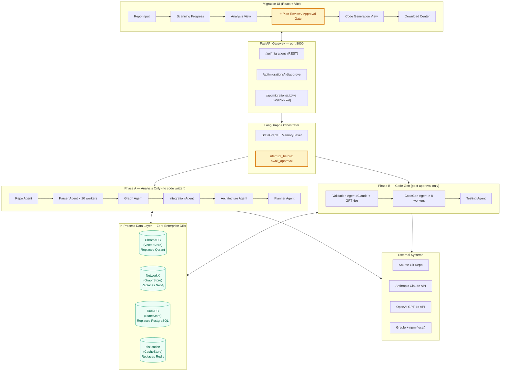
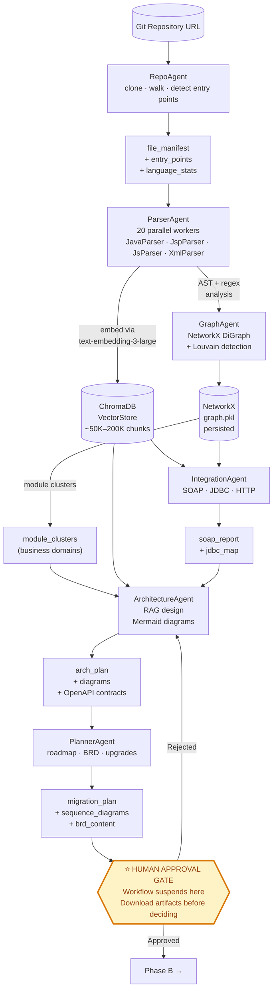
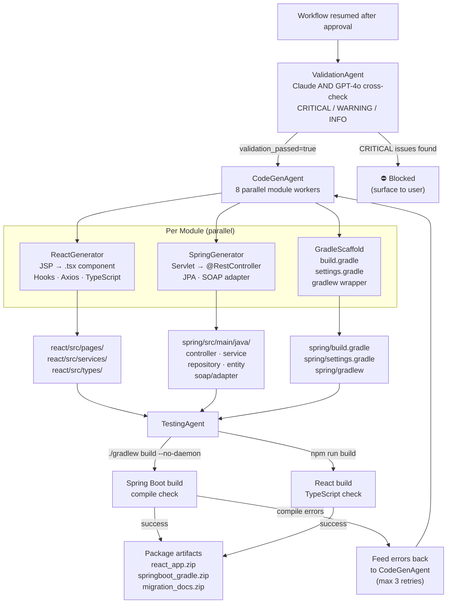
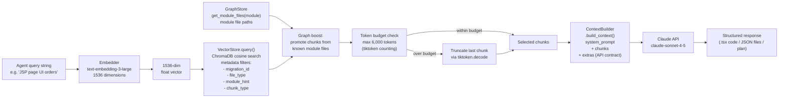
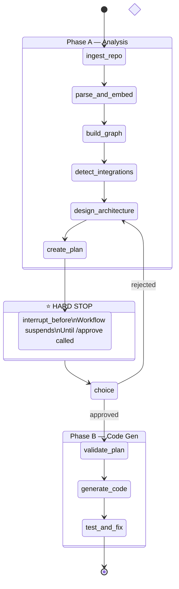

# Architecture Design — AI Migration Platform

> Converts legacy Java monoliths (JSP · Servlets · JDBC · Axis SOAP) into  
> React 18 + Spring Boot 3.3 (Gradle) — autonomously, with a human approval gate.

---

## 1. System Overview

The platform is built as **five horizontal tiers**. Data flows top-to-bottom
during Phase A (analysis). In Phase B (code generation) agents pull context
from the data layer via RAG rather than re-reading source files.

```
┌──────────────────────────────────────────────────────┐
│  TIER 1 — Migration UI (React + Vite)                 │
│  Repo Input · Progress · Plan Review · Download       │
├──────────────────────────────────────────────────────┤
│  TIER 2 — Orchestration (FastAPI + LangGraph)         │
│  REST routes · WebSocket · StateGraph · MemorySaver   │
├──────────────────────────────────────────────────────┤
│  TIER 3 — Agent Layer (9 specialised agents)          │
│  Repo · Parser · Graph · Integration · Arch · Plan   │
│  Validation · CodeGen · Testing                       │
├──────────────────────────────────────────────────────┤
│  TIER 4 — In-Process Data Layer (zero servers)        │
│  ChromaDB │ NetworkX │ DuckDB │ diskcache             │
├──────────────────────────────────────────────────────┤
│  TIER 5 — External (network only)                     │
│  Git repo · Claude API · GPT-4o · Gradle · npm        │
└──────────────────────────────────────────────────────┘
```

---

## 2. System Architecture Diagram



---

## 3. Phase A — Analysis Data Flow



---

## 4. Phase B — Code Generation Data Flow



---

## 5. RAG Pipeline Detail



---

## 6. In-Process Data Layer

All four stores run inside the Python process. Zero servers, zero ports, zero enterprise approvals.

| Store | Package | Replaces | Mode | Persistence |
|-------|---------|---------|------|-------------|
| `VectorStore` | `chromadb` | Qdrant | `EphemeralClient()` or `PersistentClient(path)` | Optional local folder |
| `GraphStore` | `networkx` + `python-louvain` | Neo4j | In-memory `DiGraph` | `graph.pkl` pickle |
| `StateStore` | `duckdb` | PostgreSQL | `connect(":memory:")` or `connect(file)` | Single `.duckdb` file |
| `CacheStore` | `diskcache` | Redis | `Cache(dir)` | Local folder (SQLite) |

### GraphStore — Node and Edge Types

```
Nodes:
  :Class    { fqn, file_path, node_type, module }
  :Method   { fqn, class_fqn, chunk_id, is_entry }
  :JSP      { path, servlet_ref, chunk_ids }
  :SOAPClient { service_name, endpoint_url, wsdl_url, stub_class, operations }
  :Table    { table_name, schema }

Edges (rel_type):
  (:Method)  -[:CALLS]->        (:Method)
  (:Method)  -[:CALLS_SOAP]->   (:SOAPClient)
  (:Method)  -[:QUERIES]->      (:Table)
  (:Class)   -[:DEPENDS_ON]->   (:Class)
  (:JSP)     -[:FORWARDS_TO]->  (:Class)
  (:JSP)     -[:INCLUDES]->     (:JSP)
```

### StateStore — DuckDB Schema

```sql
migrations        -- migration_id, repo_url, status, approval_status, state_json
file_index        -- migration_id, file_path, file_type, chunk_count, embedded
soap_integrations -- migration_id, service_name, endpoint_url, operations, migration_option
generated_files   -- migration_id, file_path, file_type, content, build_verified
progress_log      -- migration_id, event, phase, message, created_at
```

---

## 7. LangGraph Workflow Graph



---

## 8. API Endpoints

| Method | Path | Description |
|--------|------|-------------|
| `POST` | `/api/migrations` | Start a new migration — returns `migration_id` |
| `GET`  | `/api/migrations/:id` | Get status, phase, progress percentage |
| `GET`  | `/api/migrations/:id/artifacts` | Get diagrams, plan, SOAP report (pre-approval) |
| `POST` | `/api/migrations/:id/approve` | `{status: "approved"|"rejected", comment: ""}` |
| `GET`  | `/api/migrations/:id/artifacts/download/:type` | Download ZIP (`react` / `spring` / `docs`) |
| `WS`   | `/api/migrations/:id/ws` | WebSocket — live phase + progress events |
| `GET`  | `/health` | `{status: "ok", version: "1.0.0"}` |

---

## 9. Design Patterns

| Pattern | Location | Purpose |
|---------|----------|---------|
| **Strategy** | `parsers/` | `JavaParser`, `JspParser`, `JsParser` registered in `ParserRegistry` |
| **Template Method** | `agents/base.py` | `_call_llm`, `_call_llm_json`, retry decorator shared by all agents |
| **Factory / Registry** | `parsers/base.py` | `ParserRegistry.get_parser(file_path)` selects correct strategy |
| **Repository** | `storage/state_store.py` | Isolates DuckDB from domain logic |
| **Observer** | WebSocket | UI subscribes to live phase progress events |
| **Circuit Breaker** | `tenacity` decorators | 3-attempt retry with exponential backoff on all LLM calls |
| **State Machine** | LangGraph `StateGraph` | Phased workflow with conditional edges and hard interrupt |
| **Dependency Injection** | `migration_graph.py` | Stores injected into agents at construction |

---

## 10. Token Budget Strategy

All LLM calls enforce a hard ceiling of **6,000 tokens** of context.
No agent ever loads a complete source file into context.

```
Layer 1 — Chunking:       Files split at method/block level (max 512 tokens)
Layer 2 — ChromaDB RAG:   Only top-K semantically relevant chunks retrieved
Layer 3 — Graph filter:   Chunks from known module files promoted above others
Layer 4 — Budget check:   Retriever.build_context() stops at 6,000 tokens
Layer 5 — Hard truncation: Last chunk truncated via tiktoken if needed
Layer 6 — Parallel gen:   Each module context is independent (not cumulative)
```

Result: A 4,400-file codebase with ~300,000 lines can be fully analysed and
migrated with no single LLM call exceeding 6,000 tokens of context.

---

## 11. Project Structure

```
migration-platform/
├── pyproject.toml                  Hatch build + all pinned deps
├── .env.example                    Required environment variables
├── scripts/
│   └── start.sh                    Single-command startup
├── docs/
│   ├── architecture.md             This file — all system diagrams
│   ├── sequence_diagram.md         Request/response sequence flows
│   └── images/                     Diagram source files
├── src/
│   └── migration_platform/
│       ├── main.py                 FastAPI app factory + lifespan
│       ├── config/
│       │   └── settings.py         Pydantic Settings singleton (env-driven)
│       ├── core/
│       │   ├── exceptions.py       Domain exception hierarchy
│       │   └── logging.py          structlog structured logging
│       ├── domain/
│       │   ├── models/migration.py Dataclasses: MigrationStatus, CodeChunk, etc.
│       │   └── schemas/            Pydantic v2 request/response schemas
│       ├── agents/
│       │   ├── base.py             Abstract BaseAgent (Template Method)
│       │   ├── repo_agent.py       Clone + scan + file manifest
│       │   ├── parser_agent.py     Parallel chunk + embed (20 workers)
│       │   ├── graph_agent.py      NetworkX graph + Louvain clusters
│       │   ├── integration_agent.py SOAP · JDBC · HTTP detection
│       │   ├── architecture_agent.py RAG-driven target design
│       │   ├── planner_agent.py    Roadmap + BRD + sequence diagrams
│       │   ├── validation_agent.py Multi-LLM cross-check
│       │   ├── codegen_agent.py    Parallel React + Spring generation
│       │   └── testing_agent.py    ./gradlew + npm build verification
│       ├── workflows/
│       │   ├── state.py            MigrationState TypedDict (all fields)
│       │   └── migration_graph.py  LangGraph StateGraph definition
│       ├── rag/
│       │   ├── vector_store.py     ChromaDB VectorStore (replaces Qdrant)
│       │   ├── embedder.py         text-embedding-3-large + tiktoken
│       │   └── retriever.py        Token-budget-aware hybrid retrieval
│       ├── graph/
│       │   └── graph_store.py      NetworkX GraphStore + Louvain (replaces Neo4j)
│       ├── storage/
│       │   ├── state_store.py      DuckDB StateStore (replaces PostgreSQL)
│       │   └── cache_store.py      diskcache CacheStore (replaces Redis)
│       ├── parsers/
│       │   ├── base.py             BaseParser + ParserRegistry (Strategy)
│       │   ├── java_parser.py      javalang AST → per-method chunks
│       │   ├── jsp_parser.py       BeautifulSoup → scriptlet blocks
│       │   ├── js_parser.py        Regex function extraction
│       │   └── xml_parser.py       lxml → web.xml / WSDL chunks
│       ├── codegen/
│       │   ├── context_builder.py  RAG → LLM context (≤6K tokens)
│       │   ├── gradle_scaffold.py  build.gradle + settings.gradle + gradlew
│       │   ├── react_generator.py  JSP → React .tsx components
│       │   └── spring_generator.py Servlet → Spring Boot Java files
│       └── prompts/
│           └── templates.py        All LLM system prompts (centralised)
└── tests/
    ├── conftest.py                 Shared fixtures (all in-memory)
    ├── unit/
    │   ├── test_graph_store.py
    │   ├── test_state_store.py
    │   ├── test_vector_store.py
    │   ├── test_java_parser.py
    │   ├── test_jsp_parser.py
    │   └── test_js_parser.py
    └── integration/
        └── test_workflow.py        Graph compilation + approval routing
```

---

## LangChain 1.x & LangGraph 1.x Upgrade Notes

### What changed from 0.x → 1.x

| Component | 0.x Pattern | 1.x Pattern |
|-----------|-------------|-------------|
| **LLM calls** | Raw `Anthropic` / `OpenAI` SDK | `ChatAnthropic` / `ChatOpenAI` (langchain providers) |
| **Chains** | Manual retry via `tenacity` decorator | LCEL `.with_retry(stop_after_attempt=3)` on any Runnable |
| **Structured output** | `json.loads(llm_response)` + brittle parsing | `llm.with_structured_output(PydanticModel)` — typed, validated |
| **Parallel LLMs** | Sequential Claude then GPT-4o | `RunnableParallel(claude=chain_a, gpt4o=chain_b)` — concurrent |
| **Approval gate** | `interrupt_before=["node"]` at compile time | `interrupt(payload)` called **inside** the node — returns human response |
| **Parallel code gen** | `ThreadPoolExecutor` inside one node | `Send(node, state)` at graph level — LangGraph manages parallelism |
| **Routing with state** | Conditional edge + separate state update | `Command(goto="node", update={...})` — atomic route + update |
| **Prompt templates** | Raw f-strings | `ChatPromptTemplate.from_messages()` with variable injection |
| **Output parsing** | `re.sub` + `json.loads` | `JsonOutputParser()` / `StrOutputParser()` in chain |

### LCEL Chain Pattern (used in every agent)

```python
# LangChain 1.x LCEL chain — composable, retryable, type-safe
chain = (
    ChatPromptTemplate.from_messages([
        ("system", SYSTEM_PROMPT),
        ("human", "{input}"),
    ])
    | ChatAnthropic(model="claude-sonnet-4-5")
    | StrOutputParser()
).with_retry(stop_after_attempt=3, wait_exponential_jitter=True)

result: str = chain.invoke({"input": user_text})
```

### LangGraph 1.x interrupt() Pattern

```python
# LangGraph 1.x — interrupt() called inside the node
def approval_gate_node(state: MigrationState) -> dict:
    # Graph suspends here; payload is surfaced to the UI
    decision = interrupt({
        "diagrams":       state["diagrams"],
        "migration_plan": state["migration_plan"],
        "message":        "Please review and approve.",
    })
    # When graph.update_state() + graph.invoke(None) are called,
    # interrupt() returns the value passed to update_state.
    return {
        "approval_status":  decision["status"],
        "approval_comment": decision["comment"],
    }
```

### LangGraph 1.x Send API (parallel fan-out)

```python
# dispatch_codegen returns a list of Send objects
def dispatch_codegen(state: MigrationState) -> list[Send]:
    return [
        Send("generate_module", {
            "migration_id": state["migration_id"],
            "module":       mod,
            "arch_plan":    state["arch_plan"],
        })
        for mod in state["module_clusters"]
    ]
# LangGraph runs all generate_module invocations concurrently
```

### with_structured_output (LangChain 1.x)

```python
class ArchitecturePlan(BaseModel):
    bounded_contexts: list[BoundedContext] = []
    soap_migration_map: list[SoapMigrationEntry] = []

# Pydantic-typed, validated response — no JSON parsing needed
structured_llm = ChatAnthropic(...).with_structured_output(ArchitecturePlan)
plan: ArchitecturePlan = structured_llm.invoke(messages)
```
