# AI-Powered Transaction Traceability & Explainability Platform
### Enterprise Architecture & Design Blueprint

**Audience:** Enterprise Architects · CTO · Principal Engineers · Platform Engineering · AI Engineering · Operations Leadership
**Domain:** Fee Management & Payment Processing (high-volume, Java/J2EE, Oracle, Splunk, XML, JMS, legacy workflow engine)
**Document Type:** Production-oriented reference architecture

---

## 0. Executive Summary

The Fee Management & Payment Processing Engine evaluates millions of transactions per day through a dense web of business rule engines, product-qualification logic, dynamic workflow routing, conditional execution, exception handling, XML transformations and downstream integrations. Today, when Operations needs to answer *"why did transaction X behave this way?"* they manually stitch together Splunk logs, XML payloads, Oracle records, Java source and JPEG workflow diagrams. This is slow, error-prone, SME-dependent and opaque.

This blueprint proposes a **GenAI-powered Transaction Traceability & Explainability Platform** that turns that multi-hour forensic exercise into a conversational, sub-minute, fully-cited explanation with **visual path highlighting on the original workflow diagram**.

**Core design pillars:**

1. **Multi-agent orchestration** on **LangGraph** (stateful graph) with a **Java/Spring Boot control plane** and **Python AI workers**.
2. **Hybrid RAG** — vector + keyword + **graph retrieval** over five corpora (XML, Oracle, Splunk, Java code, workflow diagrams).
3. **Workflow Diagram Understanding** using Vision-LLM + OCR that converts JPEG/PNG diagrams into a machine-readable **process graph**, then overlays the actual execution path.
4. **Unified Explainability Model (UEM)** — a single correlated object joining logs, code, payloads and diagram nodes per transaction.
5. **Enterprise-grade** security (RBAC, PII masking, prompt-injection defense, audit), scalability (millions of txns, async/streaming), and governance.

**Recommended core stack:** LangGraph (orchestration) + Claude (primary reasoning/vision LLM, with on-prem Llama fallback) + **Weaviate** (vector + hybrid + graph-friendly) + Spring Boot control plane + Kafka event backbone + Kubernetes + Splunk/OpenTelemetry observability.

---

## 1. High-Level Architecture

The platform is layered into **Experience**, **Orchestration (Control Plane)**, **AI Agent Plane**, **Retrieval & Knowledge Plane**, **Ingestion Plane**, and **Source Systems**, wrapped by cross-cutting **Security/Governance** and **Observability**.

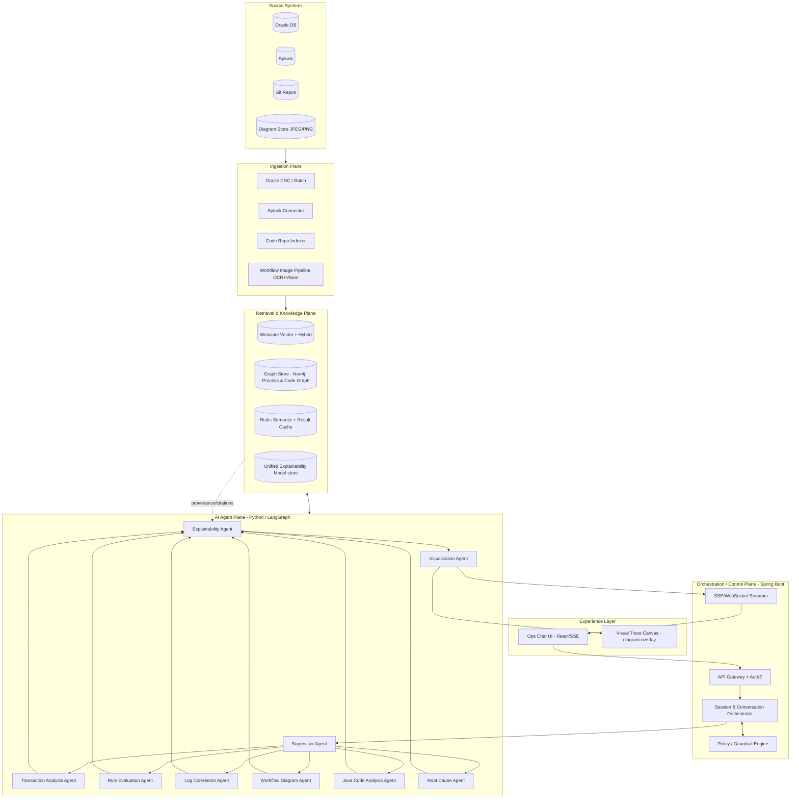

**Why a split control plane (Java) + agent plane (Python):** the enterprise already runs Spring Boot/Oracle/JMS; keeping session, security, RBAC, audit, and integration in Java preserves operational ownership and compliance posture. The AI agent plane lives in Python because the richest agent/RAG ecosystem (LangGraph, LlamaIndex, vision tooling) is Python-native. The two planes communicate over gRPC/REST + Kafka.

---

## 2. End-to-End Workflow

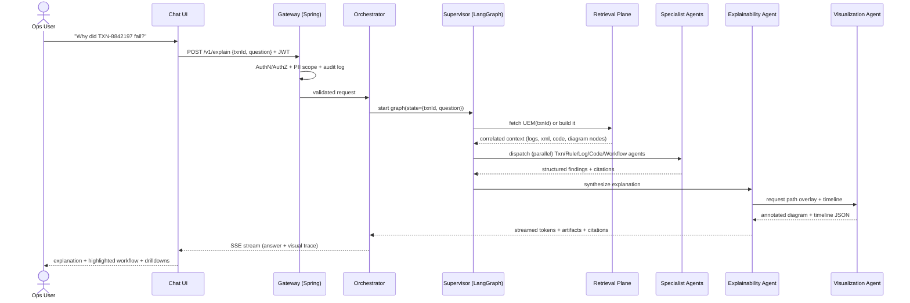

**Two retrieval modes:**
- **Hot path (online):** transaction-scoped — pull the specific txn's payloads/logs/audit on demand, correlate, explain. Target P95 < 8s for first token, < 25s full answer with visuals.
- **Warm/precomputed:** for high-volume failures, a streaming pipeline pre-builds the **UEM** so the chat answer is near-instant.

---

## 3. AI Agent Architecture

A **Supervisor (orchestrator) pattern** with specialist agents. Each agent has a narrow contract, tool access, and emits **structured JSON with citations** (never free text into the next stage).

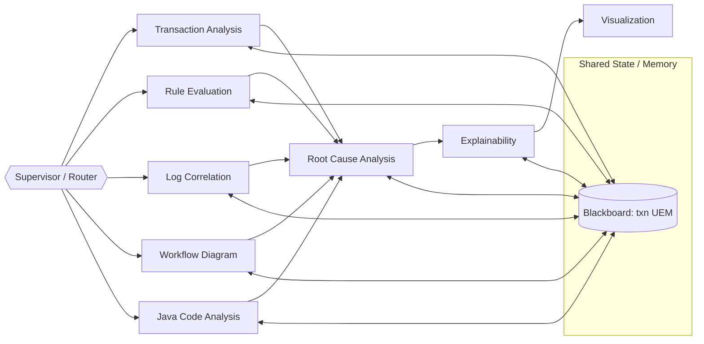

| Agent | Responsibility | Inputs | Outputs | Key Tools |
|---|---|---|---|---|
| **Supervisor** | Intent classification, plan, route, fan-out/fan-in, retries, budget control | User question, txnId, session memory | Execution plan, agent dispatch, final assembly trigger | LangGraph router, LLM planner |
| **Transaction Analysis** | Locate txn, extract lifecycle/state transitions, product mapping, status | txnId | Normalized txn timeline, status, product outcome | Oracle tool, XML parser, UEM |
| **Rule Evaluation** | Identify which rules fired, pass/fail, inputs/outputs, dependencies | txn context, rule corpus | Rule trace tree (passed/failed + reason) | Vector+graph retrieval, rule registry |
| **Log Correlation** | Join Splunk by correlation/thread IDs, build chrono trace, find exceptions | correlationId, time window | Ordered log/event trace, exception stacks | Splunk SPL tool, embeddings |
| **Workflow Diagram** | Parse diagram → graph, map nodes to executed steps, mark path/failed node | diagram image, executed steps | Process graph + executed-path overlay spec | Vision-LLM, OCR, graph builder |
| **Java Code Analysis** | Find service/rule/branch code for executed path, explain conditionals | class/method refs, stack frames | Code-grounded path explanation, branch logic | AST/repo retrieval, vector search |
| **Root Cause Analysis** | Synthesize cross-source signals → ranked root cause hypotheses | all agent outputs | Ranked causes w/ confidence + evidence | LLM reasoning, rules of inference |
| **Explainability** | Compose human answer w/ citations, faithful to evidence | RCA + all findings | Final NL explanation + structured trace | LLM, citation enforcer |
| **Visualization** | Produce annotated diagram, timeline, drilldown links | UEM + path spec | SVG/JSON overlay, timeline, links | Diagram renderer, layout engine |

**Coordination strategy:** LangGraph **stateful graph** with a shared **Blackboard** (the in-flight UEM). Independent agents (Txn, Rule, Log, Workflow, Code) run **in parallel** (fan-out); RCA→Explainability→Visualization run **sequentially** (fan-in). Supervisor enforces token/cost budgets, timeouts, and per-agent retries. Agents communicate only via typed state — never raw prose — which keeps the pipeline deterministic and auditable.

---

## 4. RAG Architecture

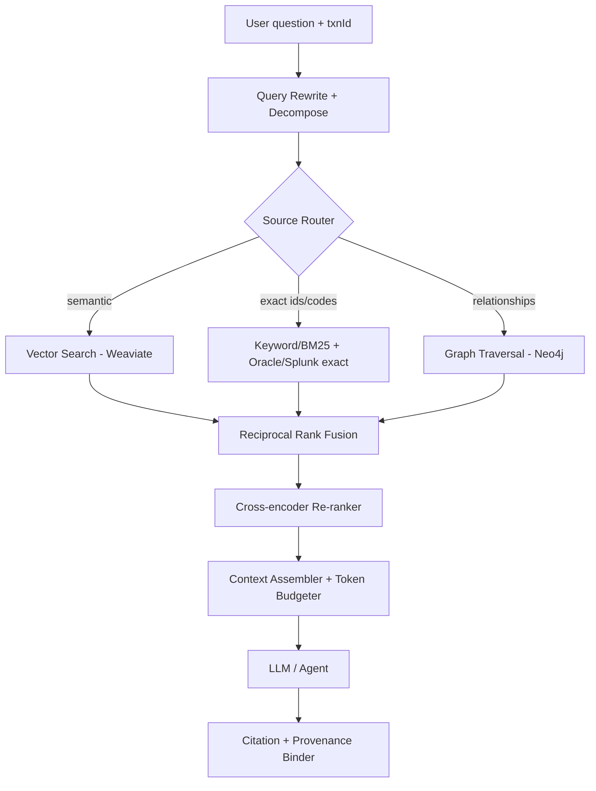

**Hybrid retrieval = vector + lexical + graph.** Transaction forensics depends heavily on **exact identifiers** (txnId, correlationId, rule codes, error codes) where pure embeddings underperform — so BM25/exact lookups are first-class. **Graph retrieval** answers structural questions ("which rules depend on rule R", "which downstream systems were invoked on this path") that flat chunks cannot.

**Per-corpus chunking & embedding strategy:**

| Corpus | Chunking | Embedding | Metadata |
|---|---|---|---|
| **XML req/resp** | Structure-aware (per logical element/segment), preserve XPath | text-embedding (code-aware) | txnId, msgType, schemaVer, xpath, direction |
| **Splunk logs** | Per correlated event group + window | log-tuned embedding | correlationId, threadId, service, severity, ts |
| **Java code** | AST-aware (method/class granularity) | code embedding (e.g. code-specialized model) | fqcn, method, file, gitSha, branchRefs |
| **Workflow diagrams** | Per node + per edge + caption blocks | multimodal/text after vision parse | diagramId, nodeId, nodeType, processName |
| **Rules/docs** | Semantic + heading-aware | general text embedding | ruleId, ruleVersion, product, owner |

**Metadata enrichment** is what makes this enterprise-grade: every chunk carries strong filters (product, txn type, version, time) so retrieval is *scoped and explainable*. **Graph-based retrieval** ties chunks to a knowledge graph: `Transaction → executedNode → ruleFired → codeMethod → downstreamCall`, enabling multi-hop traversal that directly mirrors how an SME reasons.

---

## 5. Data Ingestion Architecture

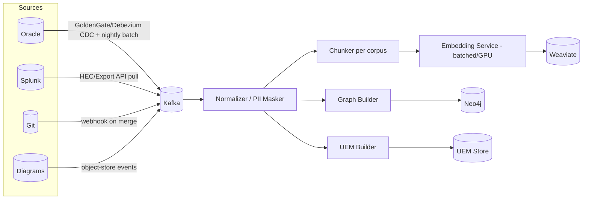

- **Oracle:** CDC (Debezium/GoldenGate) for near-real-time txn/audit changes + scheduled batch for backfill. XML payloads extracted and structure-chunked.
- **Splunk:** HTTP Event Collector / Export API; ingest by correlation window, not raw firehose. Keep Splunk as system-of-record; index summaries + embeddings only.
- **Java code:** Git webhook on merge → AST parser → method/class chunks + **code graph** (call graph, rule references, branch map) by gitSha.
- **Workflow images:** object-store event → OCR + Vision pipeline → process graph (see §9).
- Cross-cutting: **PII masking before embedding**, idempotent upserts keyed by stable IDs, schema/version tagging, and dead-letter queues for poison records.

---

## 6. Splunk Integration

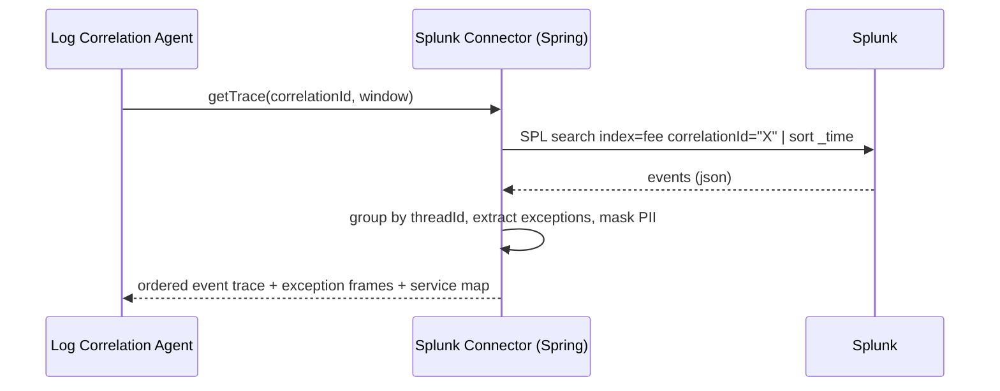

- **Access pattern:** parameterized **SPL templates** (not free-form LLM-generated SPL into prod) executed via a Spring connector with connection pooling and rate limits. The agent selects a template + fills slots; a guardrail validates it.
- **Correlation:** `correlationId` is the spine. Thread traces and service-call traces are reconstructed and aligned to the UEM timeline.
- **Hybrid:** exact `correlationId`/`errorCode` lookups via SPL; semantic search over **pre-indexed log summaries** in the vector DB for "find similar failures."
- **Performance:** cache hot correlation windows in Redis; cap result size; stream large traces.

---

## 7. Oracle Integration

- **Read-only service account** with row/column-level scoping; never lets agents issue arbitrary SQL — exposes **parameterized repositories** (`getTxn`, `getPayload`, `getAuditTrail`) behind Spring Data + MyBatis for the XML CLOBs.
- **XML payloads** stored as CLOB/XMLType: extracted, validated against schema, structure-chunked, and XPath-indexed.
- **Audit tables** become first-class timeline events in the UEM.
- **Performance:** read replica / Active Data Guard for analytical reads, bind-variable queries, connection pooling (HikariCP), and result caching. CDC keeps the vector/graph stores fresh without hammering primary.

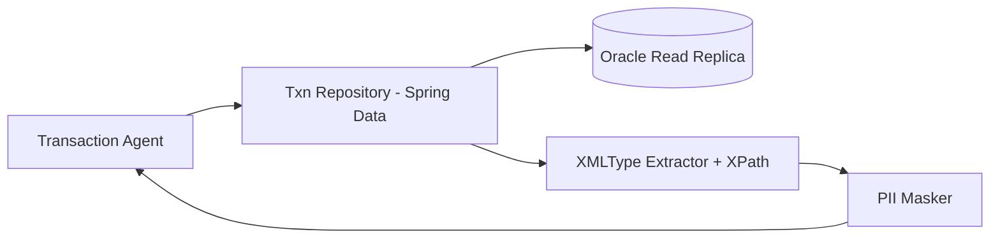

---

## 8. Java Code Analysis Architecture

The goal: ground every "the code did X" claim in **actual source at the deployed gitSha**, not LLM imagination.

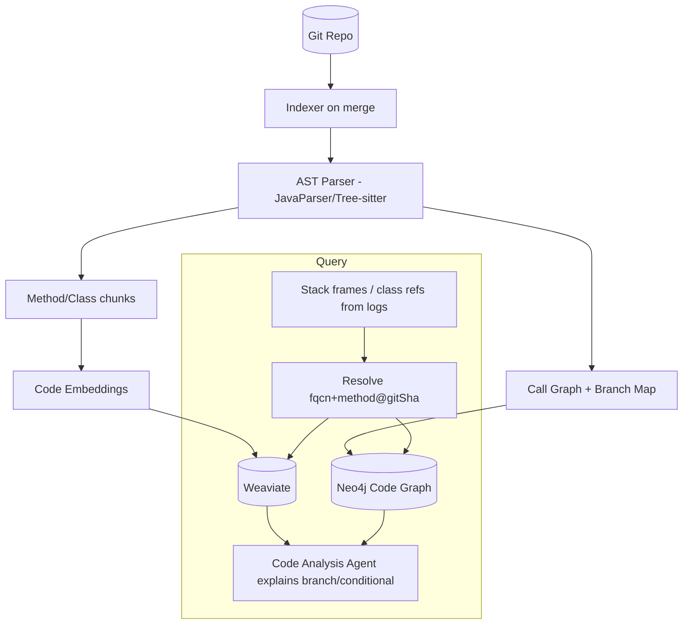

- **AST-aware indexing** (JavaParser / Tree-sitter) at method/class granularity; capture conditionals, rule-engine invocations, exception handlers, and external-service calls as graph edges.
- **Deployed-version awareness:** index per `gitSha`; the agent resolves code matching the txn's runtime build to avoid drift.
- **From log → code:** stack frames and class references in Splunk resolve to exact methods; the agent then explains the conditional that selected the path ("`if(product.isQualified())` evaluated false because `score < threshold`").
- **Drift detection:** compare diagram-derived process graph vs code-derived call graph to flag *"workflow diagram says step Y, code no longer does Y."*

---

## 9. Workflow Image Analysis Architecture

This is the differentiator: turning JPEG/PNG/BPMN images into an executable, overlayable graph.

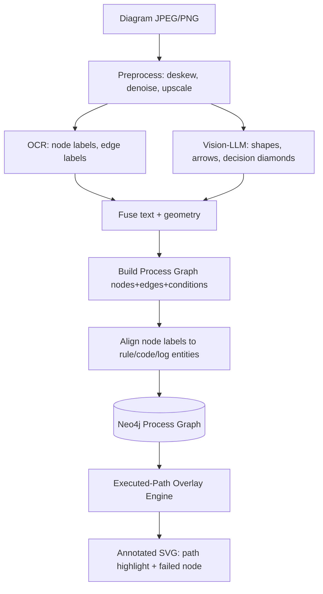

**Strategy:**
1. **OCR** (Tesseract/cloud OCR) for node and edge text labels.
2. **Vision-LLM** (Claude/GPT-4o-class multimodal) to detect shapes (process box, decision diamond, start/end), arrows/direction, and swimlanes — outputting a structured nodes+edges JSON.
3. **Fusion** of OCR text + vision geometry → a typed **process graph** (`{nodeId, type, label, condition, x,y, edges[]}`).
4. **Entity alignment:** match node labels to rule IDs / code methods / log step names via embeddings + fuzzy matching, persisted in Neo4j.
5. **Execution overlay:** given the txn's executed steps (from logs/code/UEM), the Visualization Agent highlights the taken path, marks the **failed node in red**, dims unselected branches, and renders clickable drilldowns to evidence.

**Human-in-the-loop:** first-time diagram parses are reviewed/corrected once by an SME, then cached as ground truth (diagrams change rarely).

---

## 10. Vector Database Recommendation

| DB | Hybrid Search | Scale | Graph/Metadata Filter | Security | Cost | Verdict |
|---|---|---|---|---|---|---|
| **Weaviate** | Native vector+BM25 hybrid | High (sharded) | Strong metadata, cross-refs | RBAC, multi-tenant, self-host | Med | **Recommended** |
| Pinecone | Hybrid (sparse-dense) | Very high, managed | Good metadata | SOC2, managed only | $$$ | Strong if fully managed/SaaS-OK |
| pgvector | Add-on to Postgres | Med (single-node heavy) | SQL filters, no native graph | Inherit PG | $ | Great for MVP / reuse RDBMS |
| Elasticsearch | Excellent lexical + kNN | Very high | Rich filters | Mature RBAC | $$ | Best if Splunk/ELK skills exist |
| Milvus | Vector-first | Very high | Metadata, weaker hybrid | RBAC | Med | Pure-vector scale leader |
| ChromaDB | Basic | Low/Med | Basic | Minimal | $ | Prototyping only |

**Recommendation: Weaviate** for production — native hybrid (vector + BM25) which is essential for ID-heavy transaction data, strong metadata filtering, cross-references, multi-tenancy, and self-host for data-residency. **pgvector** is the pragmatic **MVP** choice (reuses existing Postgres/Oracle ops muscle). Pair the vector DB with **Neo4j** for the explicit process/code/rule **knowledge graph** — vector DBs alone don't do multi-hop structural reasoning well.

---

## 11. Framework Comparison

| Framework | Lang | Strengths | Weaknesses | Java Compat | Prod Readiness | Fit Here |
|---|---|---|---|---|---|---|
| **LangGraph** | Py | Stateful graphs, cycles, checkpoints, HIL, parallel nodes, durable state | Newer API surface | Via service boundary | High | **Primary** — best for deterministic multi-agent orchestration w/ shared state |
| LangChain | Py | Huge integration set, RAG primitives | Abstraction sprawl, less control | Service boundary | Med-High | Use for tools/retrievers under LangGraph |
| LlamaIndex | Py | Best-in-class ingestion/RAG, graph RAG | Lighter on agent orchestration | Service boundary | High | **Use for RAG/ingestion layer** |
| CrewAI | Py | Simple role-based agents, fast to start | Less control over state/branching | Service boundary | Med | Good for quick PoC, not core |
| Semantic Kernel | C#/Py/**Java** | First-class Java SDK, planners, enterprise MS stack | Smaller agent ecosystem | **Native Java** | High | **Strong alt if team mandates JVM-only** |
| Haystack | Py | Solid prod RAG pipelines, eval | Less agentic | Service boundary | High | Alt RAG engine |
| AutoGen | Py | Flexible conversational multi-agent, research | Less deterministic, ops-heavy | Service boundary | Med | Experimentation only |

**Recommendation:** **LangGraph** for orchestration + **LlamaIndex** for ingestion/RAG + **LangChain** tool adapters, all behind a **Spring Boot control plane**. If governance mandates a JVM-only AI plane, **Semantic Kernel (Java)** is the credible single-stack alternative — accept a smaller ecosystem in exchange for one language and simpler ops.

---

## 12. AI Orchestration Strategy

- **Pattern:** Supervisor + specialist agents on a **LangGraph state machine**. State = the in-flight **UEM blackboard**.
- **Parallel fan-out** for independent retrieval agents; **sequential fan-in** for RCA → Explainability → Visualization.
- **Memory strategy:**
  - *Short-term:* conversation buffer (current session, windowed).
  - *Working:* the UEM blackboard for the active txn.
  - *Long-term:* vector-stored prior explanations + "known failure patterns" library for retrieval-augmented RCA.
  - *Episodic/audit:* every run persisted immutably for governance and eval.
- **Context management:** token budgeter ranks evidence, compresses logs, and injects only top-k cited chunks; large traces summarized hierarchically (map-reduce).
- **Prompt orchestration:** versioned, templated prompts per agent in a **prompt registry**; structured output (JSON schema / function calling) enforced; **citation enforcer** rejects any claim lacking a provenance pointer.
- **Resilience:** per-agent timeouts, retries with backoff, fallback to smaller/on-prem model, circuit breakers, and a "degraded but cited" partial answer mode.

**Agent communication example (typed state):**
```json
{
  "txnId": "TXN-8842197",
  "ruleEvaluation": {
    "fired": [
      {"ruleId":"QUAL-014","result":"FAIL","reason":"score 0.62 < threshold 0.75",
       "inputs":{"score":0.62},"citation":{"source":"oracle.audit","ref":"AUD-99213"}}
    ]
  },
  "logCorrelation": {"correlationId":"C-77a1","exceptions":[{"type":"ValidationException","frame":"FeeQualifier.qualify:142","citation":{"source":"splunk","ref":"_time=..."}}]},
  "confidence": 0.91
}
```

**Sample prompt (Explainability Agent, abridged):**
> You are an explainability agent for a payment fee engine. Using ONLY the supplied structured evidence, explain to an operations analyst why the transaction reached its outcome. Every factual claim MUST cite a provenance ref from the evidence. If evidence is insufficient, say so. Output: (1) one-line verdict, (2) ordered causal chain, (3) rules fired w/ pass/fail, (4) cited evidence list. Do not speculate.

**AI workflow pseudocode:**
```python
def explain(txn_id, question, user):
    authz(user, txn_id)                      # Java control plane
    uem = uem_store.get(txn_id) or build_uem(txn_id)
    plan = supervisor.route(question, uem)
    findings = parallel_invoke(plan.agents, state=uem)   # txn/rule/log/code/wf
    rca = root_cause_agent.run(findings)
    explanation = explainability_agent.run(rca, enforce_citations=True)
    visuals = visualization_agent.overlay(uem, rca.executed_path)
    audit.log(user, txn_id, plan, findings, explanation)
    return stream(explanation, visuals)
```

---

## 13. Security Architecture

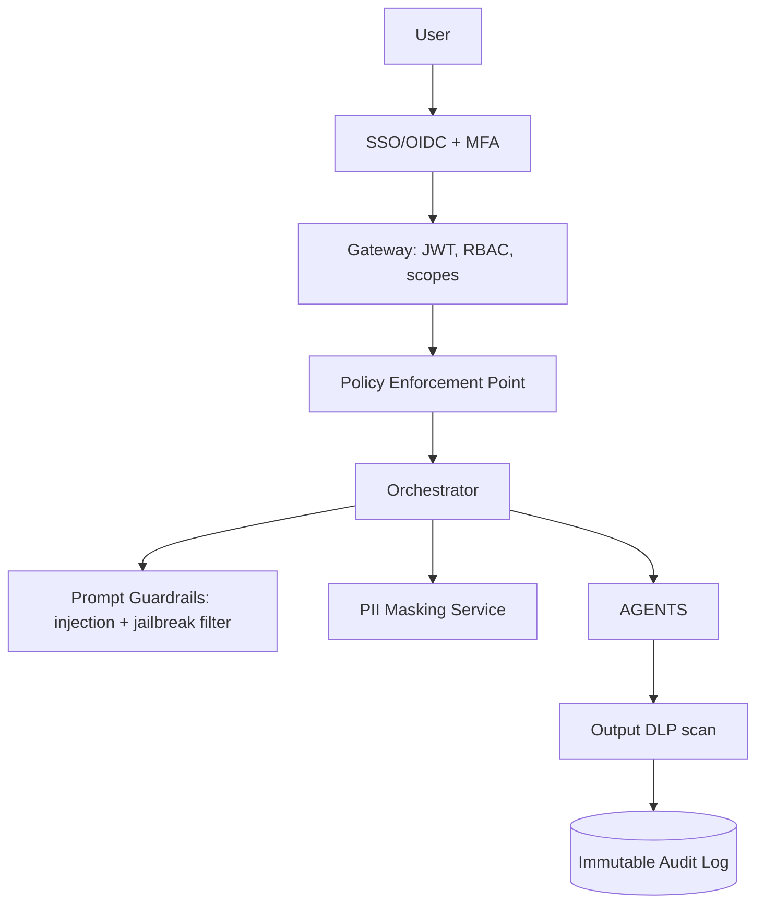

- **RBAC/ABAC:** OIDC + JWT; scopes by product line, region, and txn sensitivity. Agents inherit the **least-privilege** of the calling user — retrieval is filtered by user entitlements (no data leakage across products).
- **PII masking:** deterministic masking/tokenization *before* embedding and *before* sending to any LLM; reversible only inside the trusted Java boundary for authorized users.
- **Prompt security:** input/output guardrails for prompt injection (esp. content coming from logs/XML that an attacker could have influenced), allow-listed tool calls, no arbitrary SQL/SPL execution, schema-constrained outputs.
- **Data isolation:** per-tenant/per-product namespaces in vector + graph stores; private LLM endpoints (no training on data); VPC/private-link to model providers or on-prem models for sensitive data.
- **Auditability & compliance:** every prompt, retrieval, tool call, model version, and answer is logged immutably with the citations used — supporting PCI-DSS, SOX, and internal model-governance reviews.
- **AI governance:** model registry, prompt versioning, eval gates before promotion, hallucination/faithfulness monitoring, human-in-the-loop for low-confidence answers.

---

## 14. Scalability Strategy

| Concern | Strategy |
|---|---|
| Millions of txns | Async ingestion via Kafka; precompute UEM for high-failure cohorts; on-demand build for cold txns |
| Concurrent AI requests | Stateless agent workers, HPA autoscaling, request queue + admission control, per-tenant rate limits |
| Low-latency retrieval | Weaviate sharding/replicas, Redis semantic + result cache, narrow metadata pre-filters |
| LLM cost/latency | Model tiering (cheap router model → strong reasoning model), prompt caching, batching embeddings on GPU, response streaming |
| Large traces | Hierarchical summarization (map-reduce), windowed log fetch, pagination |
| Spiky load | Kafka buffering, backpressure, circuit breakers, graceful degradation to cited-partial answers |

**Streaming architecture:** SSE/WebSocket from Spring streamer → first-token fast, visuals streamed as they finalize. **Caching layers:** (1) semantic cache for repeated questions, (2) UEM cache per txn, (3) embedding cache, (4) Splunk-window cache.

---

## 15. Deployment Architecture

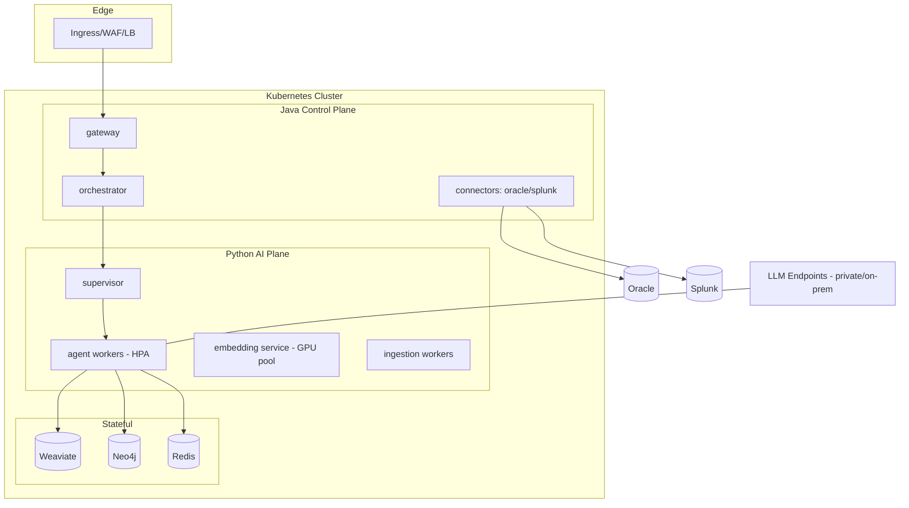

Deploy across **availability zones**, GPU node pool for embeddings/on-prem inference, separate node pools for stateful stores, and a private egress to model providers (or fully air-gapped on-prem inference for sensitive workloads).

---

## 16. Kubernetes Deployment Design

- **Namespaces:** `tep-control` (Java), `tep-ai` (Python agents), `tep-data` (stateful), `tep-ingest`.
- **Workloads:** Deployments for stateless agents/gateway; **StatefulSets** for Weaviate/Neo4j/Redis; **Jobs/CronJobs** for batch ingestion; **KEDA** scaling agent workers on Kafka lag and request queue depth.
- **HPA/VPA:** CPU+custom metrics (queue depth, P95 latency) for agent workers; GPU node pool with taints/tolerations for embedding/inference.
- **Resilience:** PodDisruptionBudgets, anti-affinity across AZs, readiness/liveness probes, graceful drain for streaming connections.
- **Config/secrets:** External Secrets + Vault; per-tenant config via ConfigMaps; NetworkPolicies enforcing plane isolation; service mesh (Istio/Linkerd) for mTLS + traffic policy.
- **Storage:** fast SSD PVs for vector/graph; backups + snapshot schedules.

---

## 17. CI/CD Architecture

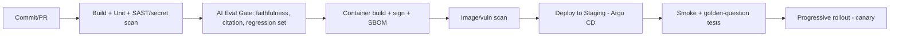

- **GitOps (Argo CD)** for declarative deploys; **prompt + model versions are artifacts** gated by an **AI eval suite** (golden transactions with known root causes; measure faithfulness, citation coverage, latency, cost) — no promotion if eval regresses.
- Standard supply-chain controls: SBOM, image signing (cosign), SAST/DAST, secret scanning.

---

## 18. Observability Strategy

- **Tracing:** OpenTelemetry across Java + Python planes; one trace spans gateway → supervisor → each agent → retrieval → LLM call. Export to Splunk/Jaeger.
- **LLM/agent metrics:** tokens, cost, latency per agent, tool-call success, retrieval hit rate, **faithfulness/hallucination score**, citation coverage, answer confidence, user thumbs-up/down.
- **Logs:** structured, correlated by requestId + txnId; feed back into the platform's own "known issues" library.
- **Dashboards & SLOs:** P95 first-token < 8s, full answer < 25s, ≥ 98% answers fully cited, cost/answer budget, eval-suite pass rate. Alert on faithfulness drop, retrieval miss spike, cost anomalies.

---

## 19. Sample User Journey

1. Ops analyst opens chat, pastes **TXN-8842197**, asks *"Why did this fail and which rule rejected it?"*
2. Gateway authenticates, confirms the analyst is entitled to that product line, logs the request.
3. Supervisor builds/loads the UEM; Txn/Rule/Log/Code/Workflow agents run in parallel.
4. RCA concludes: failed at **QUAL-014** (qualification score below threshold), surfaced as a `ValidationException` at `FeeQualifier.qualify:142`.
5. Explainability agent streams a plain-English answer with citations; Visualization agent renders the workflow diagram with the executed path highlighted and the **Qualification node in red**.
6. Analyst clicks the failed node → drills into the exact XML field, the Splunk exception, and the Java conditional. Total time: under a minute vs. hours.

---

## 20. Sample Explainability Response

> **Verdict:** TXN-8842197 failed product qualification for **Product A** and was not retried.
>
> **Causal chain:**
> 1. Request received and validated (schema OK). *[oracle.payload · MSG-441]*
> 2. Routed to **Qualification** workflow node. *[diagram:node Q1 · splunk C-77a1 step3]*
> 3. Rule **QUAL-014** evaluated qualification score = **0.62**, below threshold **0.75** → **FAIL**. *[oracle.audit AUD-99213]*
> 4. `FeeQualifier.qualify()` threw `ValidationException` at line 142; no fallback path defined. *[splunk C-77a1 · git@a1b9f code]*
> 5. Transaction marked **NON-QUALIFIED**; downstream settlement **not invoked**. *[oracle.txn status]*
>
> **Why Product A not Product B:** Product B requires field `merchantTier` which was absent; routing therefore evaluated Product A first, which then failed on score. *[diagram decision D2 · xml xpath /req/merchant]*
>
> **Recommended action:** Re-evaluate score inputs; missing enrichment from `RiskScoreService` (timeout logged) likely depressed the score. *[splunk · timeout WARN]*
>
> *Confidence: 0.91. Evidence: 6 cited sources.*

*(Accompanied by the workflow diagram with the executed path highlighted, the Qualification node in red, and a processing timeline.)*

---

## 21. Production Rollout Roadmap

| Phase | Duration | Scope |
|---|---|---|
| **0 — Foundations** | 4–6 wks | Connectors (Oracle read-only, Splunk), security baseline, UEM schema, eval harness w/ golden txns |
| **1 — MVP** | 6–10 wks | Single product line, vector RAG (pgvector), Txn+Rule+Log agents, text explanations, citations |
| **2 — Visual + Code** | 8–12 wks | Workflow diagram understanding, code analysis agent, visual path overlay, Weaviate+Neo4j |
| **3 — Scale & Govern** | ongoing | Multi-product, precomputed UEM, autoscaling, full governance, on-prem model fallback |
| **4 — Proactive** | future | Anomaly detection, auto-RCA on failure spikes, diagram-vs-code drift alerts |

---

## 22. MVP vs Future Phases

| Capability | MVP | Future |
|---|---|---|
| Sources | Oracle + Splunk | + Code + Diagrams |
| Retrieval | Vector + exact lookup | + Graph multi-hop |
| Agents | Txn, Rule, Log, Explain | + Workflow, Code, RCA, Visualization |
| Output | Cited text answer | + Visual path overlay, timeline, drilldowns |
| LLM | Hosted (private endpoint) | + On-prem fallback, fine-tuned router |
| Vector DB | pgvector | Weaviate + Neo4j |
| Scale | 1 product line | Millions of txns, all products, precompute |

---

## 23. Cost Optimization Strategy

- **Model tiering:** cheap small model for routing/classification + summarization; premium model only for final reasoning/vision.
- **Prompt + semantic caching** to avoid recomputing common questions.
- **Precompute UEM** for frequent failure cohorts (batch is cheaper than on-demand).
- **Batch GPU embeddings**; embed once, reuse (diagrams/code change rarely).
- **Token budgeting:** retrieve top-k, compress logs, avoid stuffing whole payloads.
- **On-prem/open models** (Llama-class) for high-volume, low-sensitivity steps; reserve frontier API for hard reasoning.
- **Right-size infra** with KEDA scale-to-zero for ingestion workers; FinOps dashboards tracking cost/answer.

---

## 24. Risks & Mitigation

| Risk | Impact | Mitigation |
|---|---|---|
| Hallucinated explanations | Wrong ops decisions | Citation enforcement, faithfulness eval gate, confidence + HIL on low scores |
| Diagram parse errors | Wrong path overlay | SME review on first parse, cache ground truth, drift checks |
| Code/runtime drift | Misleading code refs | Index per gitSha; resolve to deployed build |
| PII/data leakage | Compliance breach | Mask before embed/LLM, RBAC-scoped retrieval, private endpoints |
| Prompt injection via logs/XML | Tool misuse, leakage | Guardrails, allow-listed tools, no arbitrary SQL/SPL, output DLP |
| Cost overruns | Budget | Model tiering, caching, budgets, alerts |
| Splunk/Oracle load | Source instability | Read replicas, rate limits, caching, CDC not polling |
| LLM provider outage | Availability | On-prem fallback model, circuit breakers, degraded mode |
| Over-reliance / deskilling | Ops capability loss | Keep evidence drilldowns, treat AI as assistant not authority |

---

## 25. Enterprise Best Practices

- **Evidence-grounded only:** no claim without a citation; the platform's value is *traceable trust*, not eloquence.
- **Split planes:** Java control plane owns security/integration/audit; Python AI plane owns reasoning — clean contracts via gRPC/Kafka.
- **Treat prompts & models as versioned, eval-gated artifacts** in CI/CD.
- **Knowledge graph + vectors together** — structural questions need graphs.
- **Human-in-the-loop** for diagram bootstrapping and low-confidence answers.
- **Least-privilege everywhere**; agents never exceed the caller's entitlements.
- **Design for degradation:** a cited partial answer beats a confident wrong one.
- **Close the loop:** feed confirmed root causes back into the known-issues library to improve future RCA.

---

## Appendix A — Suggested Tech Stack

| Layer | Choice |
|---|---|
| Orchestration | LangGraph (+ LangChain tools) |
| RAG/Ingestion | LlamaIndex |
| Control plane | Spring Boot 3, Java 21, gRPC/REST |
| Eventing | Apache Kafka |
| Vector DB | Weaviate (pgvector for MVP) |
| Graph DB | Neo4j |
| Cache | Redis |
| LLM | Claude (reasoning+vision) primary; Llama on-prem fallback |
| Embeddings | Code-specialized + general text models (GPU-batched) |
| Vision/OCR | Multimodal LLM + Tesseract/cloud OCR |
| CDC | Debezium / GoldenGate |
| Orchestration infra | Kubernetes + Argo CD + KEDA + Istio |
| Observability | OpenTelemetry + Splunk + Grafana |
| Secrets | Vault / External Secrets |

## Appendix B — UEM (Unified Explainability Model) Schema (abridged)

```json
{
  "txnId": "string",
  "gitSha": "string",
  "product": {"resolved": "A", "candidates": ["A","B"]},
  "status": "NON_QUALIFIED|QUALIFIED|FAILED|EXCEPTION|RETRIED",
  "timeline": [{"ts":"iso","event":"string","source":"oracle|splunk|code","ref":"string"}],
  "payloads": {"requestRef":"string","responseRef":"string","xpathIndex":[]},
  "rules": [{"ruleId":"string","version":"string","result":"PASS|FAIL","inputs":{},"outputs":{},"reason":"string","deps":[],"citation":{}}],
  "executedPath": {"diagramId":"string","nodes":["Q1","D2"],"failedNode":"Q1"},
  "exceptions": [{"type":"string","frame":"fqcn.method:line","citation":{}}],
  "downstream": [{"system":"string","invoked":true,"result":"string"}],
  "rootCause": {"summary":"string","confidence":0.0,"evidence":[]},
  "provenance": [{"source":"string","ref":"string","hash":"string"}]
}
```

## Appendix C — Metadata Schema for Retrieval Chunks (abridged)

```json
{
  "chunkId":"string","corpus":"xml|log|code|diagram|rule",
  "txnId":"string|null","correlationId":"string|null",
  "product":"string","txnType":"string","gitSha":"string|null",
  "version":"string","timestamp":"iso","entityRefs":["ruleId","nodeId","fqcn"],
  "securityScope":["productLine","region"],"piiMasked":true
}
```
